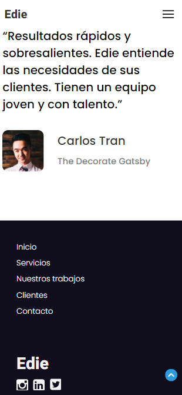

<!-- Please update value in the {}  -->

<h1 align="center">Edie homepage | Página de inicio de Edie</h1>

   Solution for a challenge from  <a href="http://devchallenges.io" target="_blank">Devchallenges.io</a>. | Solución para un desafío de <a href="http://devchallenges.io" target="_blank">Devchallenges.io</a>.

  <h3>
    <a href="https://javiervaleriano.github.io/devchallenge-edie-homepage/">
      Demo
    </a>
     | 
    <a href="https://{your-url-to-the-solution}">
      Solution / Solución
    </a>
     | 
    <a href="https://devchallenges.io/challenges/xobQBuf8zWWmiYMIAZe0">
      Challenge / Desafío
    </a>
  </h3>

<!-- TABLE OF CONTENTS -->

## Table of Contents | Tabla de contenido

- [Overview | Visión general](#overview--visi%C3%B3n-general)
  - [Built With | Construido con](#built-with--construido-con)
- [Features | Características](#features--caracter%C3%ADsticas)
- [Acknowledgements | Agradecimientos](#acknowledgements--agradecimientos)
- [Contact | Contacto](#contact--contacto)

<!-- OVERVIEW -->

## Overview

### Desktop | Escritorio

.png)
.png)
.png)

### Mobile | Móvil

Hello everyone, I hope you are well. This is my [solution](https://{solution-url}) to [challenge](https://devchallenges.io/challenges/xobQBuf8zWWmiYMIAZe0) from Devchallenges.io |
Hola a todos, espero que estén bien. Esta es mi [solución](https://{solution-url}) al [desafío](https://devchallenges.io/challenges/xobQBuf8zWWmiYMIAZe0) de Devchallenges.io

Here you can see my [demo](https://javiervaleriano.github.io/devchallenge-edie-homepage/). |
Aquí pueden ver mi [demo](https://javiervaleriano.github.io/devchallenge-edie-homepage/).

lang="en": To this project I added several details of value to the user experience and in terms of design it is very faithful to what is expected. In addition, the form fields to enter the email have validation with JavaScript and CSS styles applied to make it easy to understand if you are typing a valid email address or not.

 This development experience has allowed me to learn about and interact for the first time with the IntersectionObserver API that helps me pop up DOM elements when they cross the viewport.

Also, among my personal touches, I dynamically change every 5 seconds the footer link to my developer profiles.

lang="es": A este proyecto le agregué varios detalles de valor para la experiencia de usuario y en cuanto a diseño es muy fiel al que se espera. Además, los campos de formulario para introducir el correo electrónico tienen validación con JavaScript y estilos CSS aplicados para que sea fácil de entender si se está escribiendo una dirección de correo válida o no.

 Esta experiencia de desarrollo me ha permitido conocer e interactuar por primera vez con la API de IntersectionObserver que me ayuda a hacer aparecer elementos del DOM cuando se cruzan por el viewport.

Además, entre mis toques personales, cambio dinámicamente cada 5 segundos el enlace del footer a mis perfiles de desarrollador.

### Built With

<!-- This section should list any major frameworks that you built your project using. Here are a few examples.-->

- [HTML](https://developer.mozilla.org/es/docs/Learn/HTML/Introduction_to_HTML)
- [CSS](https://developer.mozilla.org/es/docs/Learn/CSS)
- [JavaScript](https://developer.mozilla.org/es/docs/Web/JavaScript)

## Features

<!-- List the features of your application or follow the template. Don't share the figma file here :) -->

This application/site was created as a submission to a [DevChallenges](https://devchallenges.io/challenges) challenge. The [challenge](https://devchallenges.io/challenges/xobQBuf8zWWmiYMIAZe0) was to build an application to complete the given user stories: |
Esta aplicación/sitio se creó como una entrega a un desafío de [Devchallenges](https://devchallenges.io/challenges). El [desafío](https://devchallenges.io/challenges/xobQBuf8zWWmiYMIAZe0) fue crear una aplicación para completar las historias de usuario dadas:

- User story: I can see a page following the given design. |
Puedo ver una página siguiendo el diseño dado.

- User story: I can see a page on mobile following the given design. |
Puedo ver una página en móviles siguiendo el diseño dado.

- User story: I can go to certain locations by selecting links in navigation or footer. |
Puedo ir a determinadas partes seleccionando enlaces en la barra de navegación o en el footer.

Extra: Surprise me with mobile navigation. |
Extra: Sorpréndeme con la navegación móvil.

## Acknowledgements

<!-- This section should list any articles or add-ons/plugins that helps you to complete the project. This is optional but it will help you in the future. For example -->

- [Los elementos blockquote, cite y q](http://desarrolloweb.dlsi.ua.es/libros/html-css/los-elementos-blockquote-cite-q)
- [Curso JavaScript: 76. DOM: Delegación de Eventos - #jonmircha](https://www.youtube.com/watch?v=j2fWSgOrxRs&list=PLvq-jIkSeTUZ6QgYYO3MwG9EMqC-KoLXA&index=77)
- [HTML Best Practices](https://github.com/hail2u/html-best-practices)
- [HTML  loading Attribute](https://www.w3schools.com/tags/att_img_loading.asp)
- [Window.pageYOffset](https://developer.mozilla.org/en-US/docs/Web/API/Window/pageYOffset)
- [HTMLElement.offsetTop
](https://developer.mozilla.org/es/docs/Web/API/HTMLElement/offsetTop)
- [Window.scroll()](https://developer.mozilla.org/es/docs/Web/API/Window/scroll)
- [Animaciones al Scrollear con Intersection Observer | Javascript](https://www.youtube.com/watch?v=cVsqA4NhDoI)

## Contact

- [Devchallenges profile | Perfil de Devchallenges](https://devchallenges.io/portfolio/javiervaleriano)
- Codepen: [@javiervaleriano](https://codepen.io/javiervaleriano)
- GitHub: [@javiervaleriano](https://github.com/javiervaleriano)
- Instagram: [@javiervalerianoz](https://www.instagram.com/javiervalerianoz/)
- Twitter: [@javaleriano2](https://twitter.com/javaleriano2)
